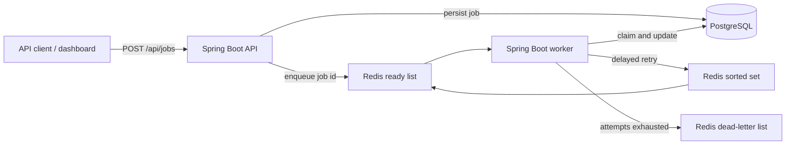

# Pulse Queue

[](https://github.com/vishnukanchi9/pulse-queue/actions/workflows/ci.yml)

A distributed job queue built with Java, Spring Boot, PostgreSQL, Redis, and Docker. An API accepts work, Redis delivers it to workers, and PostgreSQL is the durable system of record for job state.

## Architecture



PostgreSQL owns durable job state. Redis is the delivery and scheduling layer, which keeps worker polling fast without making Redis the source of truth.

## What it demonstrates

- Separate API and worker processes from one application image.
- Atomic job-state transitions: `QUEUED → PROCESSING → SUCCEEDED`, `RETRY_SCHEDULED`, or `DEAD_LETTER`.
- Exponential retry delays capped at five minutes.
- A Redis sorted set schedules delayed retries; a worker promotes due jobs back into the ready queue.
- A Redis dead-letter queue receives jobs that exhaust their retry budget.
- Flyway migrations own the PostgreSQL schema; Hibernate only validates it.
- A responsive control-room dashboard provides live totals, filtering, submission, and job inspection.
- GitHub Actions runs the tests and builds the production image on every pull request and push to `main`.

## Run

```powershell
docker compose up --build
```

Open [http://localhost:8080](http://localhost:8080) for the dashboard. It refreshes automatically every five seconds.

Submit a normal job:

```powershell
Invoke-RestMethod -Method Post http://localhost:8080/api/jobs -ContentType 'application/json' -Body '{"queueName":"notifications","payload":"{\"message\":\"welcome\"}","maxAttempts":3}'
```

Submit a job that demonstrates retries and the dead-letter queue:

```powershell
Invoke-RestMethod -Method Post http://localhost:8080/api/jobs -ContentType 'application/json' -Body '{"queueName":"notifications","payload":"{\"simulateFailure\":true}","maxAttempts":3}'
```

Use `GET /api/jobs/{id}` to watch a job move through its states, or `GET /api/jobs` to see all jobs.

## API

| Method | Path | Purpose |
| --- | --- | --- |
| `POST` | `/api/jobs` | Submit durable work and return `202 Accepted` |
| `GET` | `/api/jobs` | List jobs for monitoring |
| `GET` | `/api/jobs/{id}` | Inspect one job and its retry history |
| `GET` | `/api/jobs/stats` | Count jobs by lifecycle state |
| `GET` | `/healthz` | Check API health |

## Verify

```powershell
mvn test
docker compose up --build -d
Invoke-RestMethod http://localhost:8080/healthz
```

To stop the local stack without deleting its data:

```powershell
docker compose down
```

## Design choices

- **Separate API and worker containers:** they scale independently while sharing one tested application image.
- **Exponential backoff:** repeated downstream failures do not create a retry storm; delays cap at five minutes.
- **Dead-letter isolation:** exhausted jobs remain visible for investigation instead of disappearing or blocking healthy work.
- **Database-backed state transitions:** the dashboard can reconstruct job history even if Redis restarts.
- **Flyway-owned schema:** the same reviewed migration runs locally, in CI, and in production.

## Deliberate limitation

Redis delivery is at-least-once. A production implementation would add a transactional outbox to close the small gap between persisting a job and enqueueing it, make downstream processors idempotent, add authentication, and expose Prometheus metrics.
