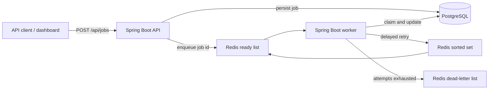

# Pulse Queue

[](https://github.com/vishnukanchi9/pulse-queue/actions/workflows/ci.yml)

A distributed job queue built with Java, Spring Boot, PostgreSQL, Redis, and Docker. An API accepts work, Redis delivers it to workers, and PostgreSQL is the durable system of record for job state.

## Durability: the PostgreSQL/Redis seam

`submit` commits the job row and then publishes its id to Redis. Those are two systems
with no transaction between them — the classic dual-write — and pretending otherwise
would be the real flaw. The design instead makes the failure **recoverable**:

- **PostgreSQL is the system of record. Redis is only a delivery hint.** The write order
  matters: a durable row with no queue entry can be found again, whereas an id in Redis
  with no row behind it would be a job nobody could reconstruct.
- **A publish failure does not fail the caller.** The job is already durable, and
  reporting an error would suggest the submission was lost when it was not.
- **`OrphanReaper` sweeps for rows stuck in `QUEUED`** past a grace period and republishes
  them. A non-empty sweep logs at `WARN`, because it means the two stores actually diverged.
- **Delivery is therefore at-least-once, and execution is exactly-once.** The reaper
  republishes without checking Redis membership — that check would be an O(n) scan of the
  ready list on every sweep — so duplicates are expected. `claim` takes a
  `PESSIMISTIC_WRITE` lock on the row, which is what collapses them.

`DurabilityTest` proves each half: a job whose Redis publish is deliberately destroyed is
recovered and completes with `attempts == 1`, and a job delivered twice runs once.

The remaining cost is that `execute` holds the row lock for the life of the payload, which
would matter for long-running work. An outbox table plus a publisher would remove the gap
entirely rather than repairing it after the fact; the reaper is the cheaper trade for a
queue this size.

## Architecture



PostgreSQL owns durable job state. Redis is the delivery and scheduling layer, which keeps worker polling fast without making Redis the source of truth.

## What it demonstrates

- Separate API and worker processes from one application image.
- Atomic job-state transitions: `QUEUED → PROCESSING → SUCCEEDED`, `RETRY_SCHEDULED`, or `DEAD_LETTER`.
- Exponential retry delays capped at five minutes.
- A Redis sorted set schedules delayed retries; a worker promotes due jobs back into the ready queue.
- A Redis dead-letter queue receives jobs that exhaust their retry budget.
- Flyway migrations own the PostgreSQL schema; Hibernate only validates it.
- A responsive control-room dashboard provides live totals, filtering, submission, and job inspection.
- GitHub Actions runs the tests and builds the production image on every pull request and push to `main`.

## Run

```bash
docker compose up --build
```

Open [http://localhost:8080](http://localhost:8080) for the dashboard. It refreshes automatically every five seconds.

Submit a normal job:

```bash
curl -X POST http://localhost:8080/api/jobs \
  -H "Content-Type: application/json" \
  -d '{"queueName":"notifications","payload":"{\"message\":\"welcome\"}","maxAttempts":3}'
```

Submit a job that demonstrates retries and the dead-letter queue:

```bash
curl -X POST http://localhost:8080/api/jobs \
  -H "Content-Type: application/json" \
  -d '{"queueName":"notifications","payload":"{\"simulateFailure\":true}","maxAttempts":3}'
```

Use `GET /api/jobs/{id}` to watch a job move through its states, or `GET /api/jobs` to see all jobs.

## API

| Method | Path | Purpose |
| --- | --- | --- |
| `POST` | `/api/jobs` | Submit durable work and return `202 Accepted` |
| `GET` | `/api/jobs` | List jobs for monitoring |
| `GET` | `/api/jobs/{id}` | Inspect one job and its retry history |
| `GET` | `/api/jobs/stats` | Count jobs by lifecycle state |
| `GET` | `/healthz` | Check API health |

## Verify

```bash
./mvnw verify          # or: mvn verify
docker compose up --build -d
curl http://localhost:8080/healthz
```

`verify` runs the full suite: `RetryPolicyTest` covers the backoff arithmetic, while
`QueueLifecycleTest` and `DurabilityTest` start a real PostgreSQL and a real Redis through
Testcontainers, so **a running Docker daemon is required**. The image build itself skips
tests, since there is no Docker socket inside a build.

**What the suite proves**

| Test | Claim it defends |
| --- | --- |
| A healthy job succeeds on the first attempt | The happy path actually runs |
| A failure schedules a retry with a future backoff | Retries are deferred, and scored into Redis so they survive a worker restart |
| Repeated failure stops at the attempt ceiling and dead-letters | The budget is respected, not overshot |
| A single-attempt job dead-letters without being scheduled | No phantom retry when none is allowed |
| The retry set is drained after promotion | Nothing re-enqueues forever |
| One poisoned job does not disturb the others | A bad payload cannot stall the queue |
| A job whose Redis publish is destroyed still completes | The reaper genuinely recovers stranded work |
| A job delivered twice runs once | The claim lock collapses at-least-once delivery |

To stop the local stack without deleting its data:

```bash
docker compose down
```

## Design choices

- **Separate API and worker containers:** they scale independently while sharing one tested application image.
- **Exponential backoff:** repeated downstream failures do not create a retry storm; delays cap at five minutes.
- **Dead-letter isolation:** exhausted jobs remain visible for investigation instead of disappearing or blocking healthy work.
- **Database-backed state transitions:** the dashboard can reconstruct job history even if Redis restarts.
- **Flyway-owned schema:** the same reviewed migration runs locally, in CI, and in production.

## Deliberate limitations

Named rather than hidden:

- **`execute` holds the row lock for the life of the payload.** That is what makes a
  redelivered job run once, but long-running work would hold a lock for its duration.
  Splitting claim from execution, with a lease and a heartbeat, is the usual answer.
- **Recovery is a sweep, not an outbox.** The reaper repairs the PostgreSQL/Redis gap
  after the fact; a transactional outbox would prevent it arising. The sweep is the
  cheaper trade at this size, and its cost is up to one grace period of delay before a
  stranded job is noticed.
- **No authentication.** The API is open, which is fine for a demo and not for anything else.
- **No metrics endpoint.** `GET /api/jobs/stats` covers the dashboard; Prometheus and
  per-queue histograms would be the next step.
- **The processor is a stub.** `JobProcessor` fails deterministically on a payload flag so
  retry and dead-letter behaviour are demonstrable without an external vendor.
